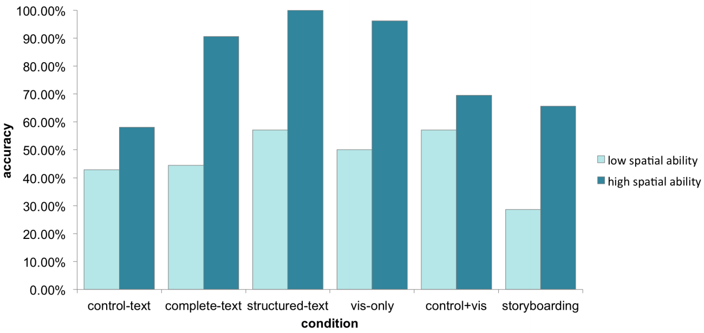

Improving Bayesian Reasoning: The Effects of Phrasing, Visualization, and Spatial Ability
===
Consider the following problem:

> The probability of breast cancer is 1% for women at age forty who participate in routine screening. If a woman has breast cancer, the probability is 80% that she will get a positive mammography. If a woman does not have breast cancer, the probability is 9.6% that she will also get a positive mammography.

> A woman in this age group had a positive mammography in a routine screening. What is the probability that she actually has breast cancer?

Misinterpretation of this and other medical test statistics can have serious adverse consequences. Despite decades of research, the optimal methods for improving interpretation of diagnostic test results remain elusive, and the available evidence is sparse and conflicting.

In this study, we try to reconcile the inconsistent reports on accuracy in Bayesian reasoning tasks such as this, and suggest techniques that offer a significant improvement over existing methods. We believe that these findings can have immediate impact on risk communication in health-related fields.

This repo contains the experiment data for our [InfoVis '15 paper](http://www.eecs.tufts.edu/~alvittao/files/bayes.pdf).

In [Experiment 1: Text-Only Representations](https://github.com/TuftsVALT/bayes/blob/master/data_experiment1.csv), we explore how the wording of the problem impacts accuracy.

In [Experiment 2: Text and Visualization](https://github.com/TuftsVALT/bayes/blob/master/data_experiment2.csv), we examine how various text + visualization reasoning aides impact accuracy.

